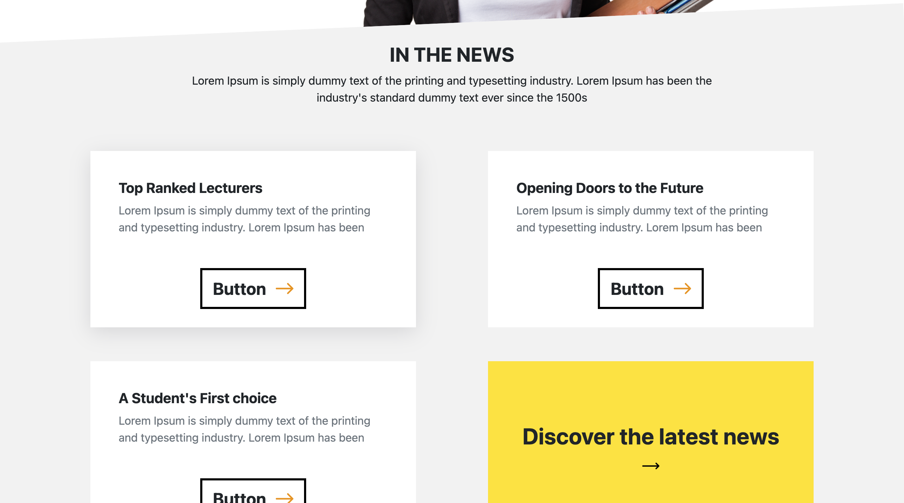
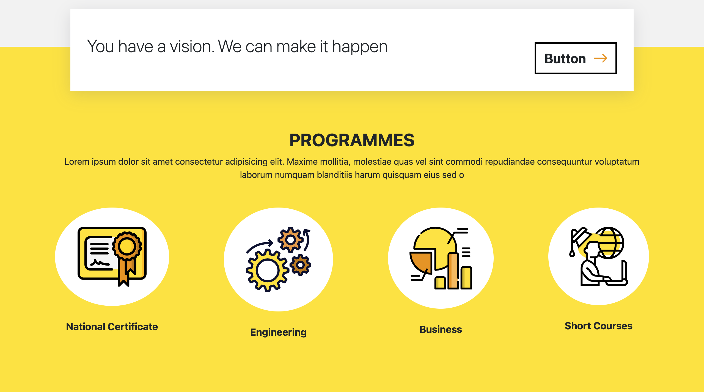
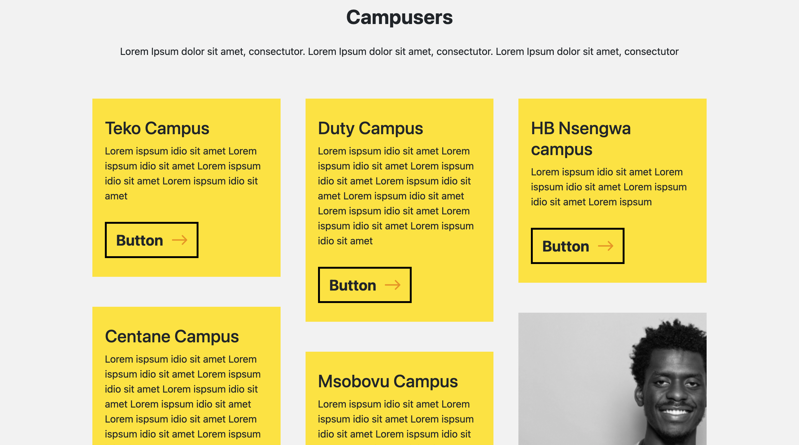
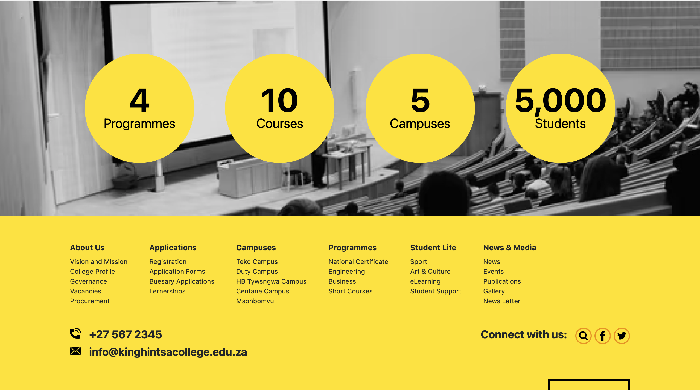

## Live Demo

https://frontend-assignment-chi-nine.vercel.app/

## Screen shots







## Built With

- JSX, CSS, Bootstrap
- React

# Set Up

## Clone This Repository

```
$ git clone https://github.com/emmyobonyo/Frontend-Assignment.git
$ cd Frontend-Assignment
```

## Run Project

```
$ npm install
$ npm start
```

## Comments

- I had to learn a few things, like drop down menus in plain CSS. Thanks for the opportunity.
